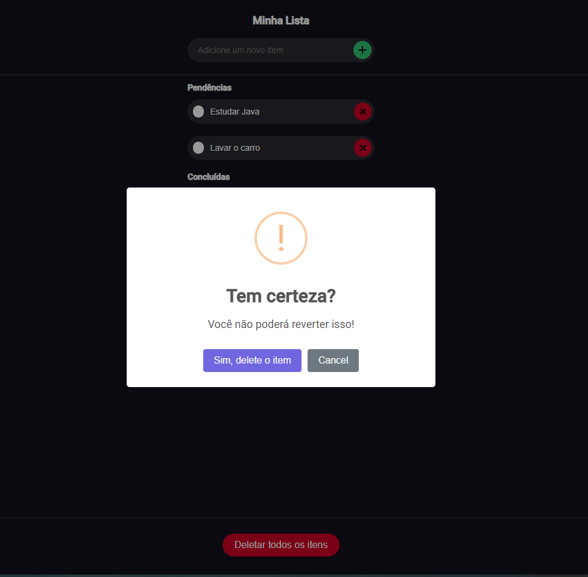

# Lista de Tarefas Angular 17.0.2

Esta aplicação Angular foi desenvolvida como parte de um projeto de estudos, visando demonstrar o uso de componentes, @Input e @Output, além de integração com o LocalStorage para armazenamento de dados localmente. Além disso, a biblioteca Sweet Alert foi utilizada para fornecer uma experiência de usuário mais agradável ao lidar com mensagens de alerta.

<p float="left">
  
   
</p>


## Pré-requisitos

Antes de iniciar, certifique-se de ter o seguinte instalado em sua máquina:

- Node.js e npm (geralmente instalados juntos). Você pode baixá-los em [nodejs.org](https://nodejs.org/).
- Angular CLI (Command Line Interface). Você pode instalá-lo globalmente com o comando npm:

```bash
npm install -g @angular/cli
````

## Instalação
1. Clone este repositório para o seu ambiente local:
    ```bash
   git clone https://github.com/seu-usuario/nome-do-repositorio.git

2.  Navegue até o diretório da aplicação:
    ```bash
    cd nome-do-repositorio
    
3.  Instale as dependências do projeto:
    ```bash
    npm install

## Uso
Para iniciar a aplicação localmente, utilize o comando:

```bash
ng serve
````
Depois de compilar com sucesso, abra um navegador e acesse `http://localhost:4200/`.

## Funcionalidades
- Adicionar uma nova tarefa.
- Marcar uma tarefa como concluída.
- Remover uma tarefa da lista.
- Remover todas as tarefas da lista.
- Armazenamento local das tarefas utilizando o LocalStorage.
- Integração de Sweet Alert para mensagens de confirmação.

